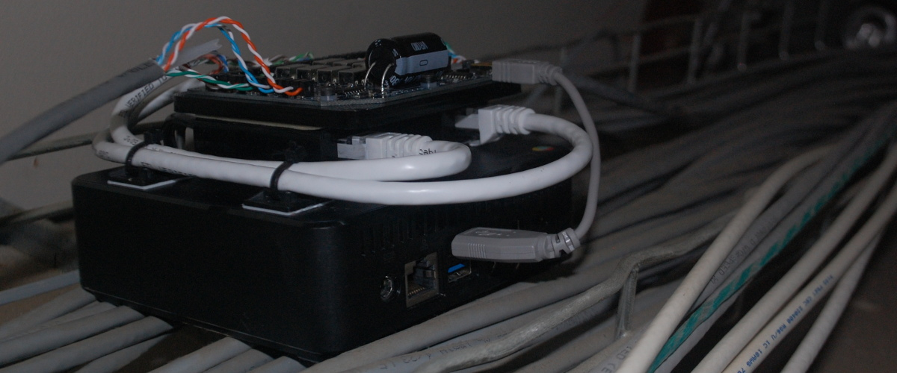

# lens
*lens* stands for "live editing of network streams"

*lens* is a framework that allows you to tap live cabling for inspection and injection.

Defcon 23
=========

Watch the video of our presentation [here](https://www.youtube.com/watch?v=RoOqznZUClI)!

[Slides](docs/LENS_DEFCON_23_slides.pdf) & [whitepaper](docs/lens_whitepaper.pdf) are available in the [docs/](docs) folder.

Or, photos of the device we presented can be found [here](http://eric.van.al/lens).

You can reach us through github, or our emails are listed in our github profiles ([Zach](https://github.com/zbanks/), [Eric](https://github.com/ervanalb/)).

Hardware
========

A network cable can be punched-down into the *lens* tap board in two places without cutting any wires. The tap board the provides a redundant copper path through a set of relays. Once all of the wires have been punched down, in two places, they can be cut so that the signals are now routed through the relays on the tap board.

One or two additional NICs are connected to the tap board on its TAP ports. These, along with a USB link, are connected to a computer. The computer can command the relays over USB to assume either a passive or active tap topology, or a transparent pass-through mode.

The tap board has three safety features: fail-safe power loss, heartbeat, and tamper detection. If the board detects that power has been lost, it can optionally use the remaining energy stored in a large capacitor to revert the state of the relays to pass-through mode. Alternatively, if the board fails to receive a heartbeat from the computer within a specified amount of time, such as if the computer software crashes, it can revert the relays. Lastly, the board has an accelerometer on it that can detect if the board is jostled or moved and report that to the computer. This can give you peace of mind that your board is still in-place and working.

Software
========

The *lens* software was made to work nicely with the tap board, but can be used without it. Simply connect two NICs in a man-in-the-middle configuration.

*lens* implements a software network stack designed for man-in-the-middle attacks. It is able to decode many protocols, edit their data payloads, and forge new packets containing the modified payloads that look as similar to the original ones as possible.

*lens* is single-threaded and uses asynchronous I/O through *tornado*. Many operations are implemented as tornado coroutines.

Network Layers
--------------

The software is split into *layers*, each of which manages its own state and provides an abstraction for the layers above it. These layers generally follow the standard "OSI Model." For instance, *Ethernet*, *IPv4*, *TCP*, *HTTP*, are some of the layers we have.

### State & Connections

Some layers are inherently stateful with respect to the data that is passed through them (e.g. TCP), whereas others do not require any state to handle their data (e.g. IPv4). However, these layers may find it useful to maintain state in order to later forge packets.

Layers are represented as subclasses of ``NetLayer``. Layers are chained together to form a doubly-linked DAG (typically a tree), where each layer knows its *parent* (``parent``) and its *children* (``children``) that come "above" it in the stack. For example, an instance of ``EthernetLayer`` may have an ``IPv4Layer`` in its ``children`` list. That ``IPv4Layer``'s ``parent`` would be a reference back to the ``EthernetLayer`` instance.

For the purposes of this document, this kind of relationship will be described as ``EthernetLayer --> IPv4Layer``, even though the connection is in fact double-ended, and the layers are instances.

### Methods

Each layer (subclassing ``NetLayer``) should implement the following methods as tornado coroutines:

- ``Layer.on_read(self, src, header, payload)``

This coroutine is called whenever there is new data (``payload``) available for the layer to process. ``header`` is a ``dict`` which holds all of the information extracted from all of the previous layers. With ``payload`` and ``header``, it should be possible to completely reconstruct the original packet. ``src`` represents where the data came from. A simple ``on_read`` might move some data from ``payload`` into ``header`` and call ``Layer.bubble(src, new_header, sub_payload)`` to pass data to children layers.

- ``Layer.write(self, dst, header, payload)``

This coroutine is called to write out ``payload``. A simple ``write`` would take relevant parameters in ``header``, re-serialize them, and combine them with ``payload`` to form a new payload. It would then call ``Layer.write_back(dst, header, new_payload)`` to pass the back to the parent layer.

- ``Layer.match(self, src, header)``

This function should return a boolean indicating whether this layer is capable of handling the given packet. The default behavior, if not overridden, is to always return ``True``, that is, consume all data.

#### Routing

Currently, ``src`` and ``dst`` parameters represent which physical NIC the message came from or is intended to go to. ``NetLayer`` implements two functions, ``route(src)`` and ``unroute(dst)``, which are intended to resolve the intended recipient of a packet. This mechanism might need to be re-worked for systems with 3+ NICs. Currently, the two NICs are represented by ``0`` and ``1``, so the functions are equivalent.

#### Useful Methods

Although each ``NetLayer`` should implement the methods above, there are some additional helper methods/coroutines that are useful:

- ``Layer.bubble(self, src, header, payload)``

This coroutine will attempt to further decode a payload using this layer's ``children``. It will go through the list of children until it finds one whose ``match(...)`` function returns ``True``. It will then call that child's ``on_read(...)`` function. If no child matches, it calls ``self.write(dst, ...)``, resolving ``dst`` from ``src``, at which point the program flow "reverses direction".

This method is used to pass data on to higher layers for further decoding. If no higher layer is available or connected it will re-write (loopback) the data unchanged.

- ``Layer.write_back(self, dst, header, payload)`` 

This coroutine calls ``self.parent.write(dst, header, payload)``. It is for further encoding a payload using this layer's ``parent``. It can be thought of as the opposite of ``Layer.bubble(...)``.

- ``Layer.passthru(self, src, header, payload)``

This convenience coroutine will call ``self.write_back(dst, ...)`` with ``dst`` resolved from ``src``.
